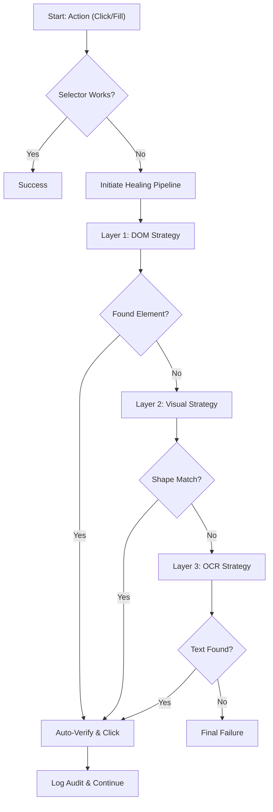

# Self-Healing Locators: Architecture Overview

A multi-layered defense system that automatically repairs broken UI selectors during test execution.

---

## 1. The Healing Pipeline
When a locator fails, the engine falls back through increasingly advanced recovery strategies.

---

## 2. Deep Dive: Three Layers of Survival

### 🧬 Layer 1: DOM Strategy (Structural Analysis)
*   **The Brain:** Analyzes the HTML source code.
*   **Mechanism:** Compares the old element's attributes (ID, Class, XPath) against the current DOM to find the closest logical match.
*   **Best for:** When an ID changes but the element structure remains similar.

### 🖼️ Layer 2: Visual Strategy (Computer Vision)
*   **The Eyes:** Uses OpenCV for template matching.
*   **Mechanism:** Ignores the code entirely. It takes a screenshot and looks for a "visual match" of the button based on its shape, color, and size.
*   **Best for:** Dynamic websites where IDs and class names change on every deployment.

### 📝 Layer 3: OCR Strategy (Text Recognition)
*   **The Reader:** Uses Tesseract.js (Optical Character Recognition).
*   **Mechanism:** Scans the page for specific text strings (e.g., "SUBMIT"). It finds the exact X/Y coordinates of the text pixels and clicks them.
*   **Best for:** Major UI redesigns where only the label text remains consistent.

---

## 3. Business Value

> [!TIP]
> **50% Reduction in Maintenance**
> Developers spend less time fixing "flaky" tests caused by minor UI tweaks.

> [!IMPORTANT]
> **Faster Release Cycles**
> Tests don't block the pipeline due to simple CSS/HTML changes.

> [!NOTE]
> **Self-Documenting Audits**
> Every repair is logged, allowing engineers to update the "real" selectors later without urgent pressure.
